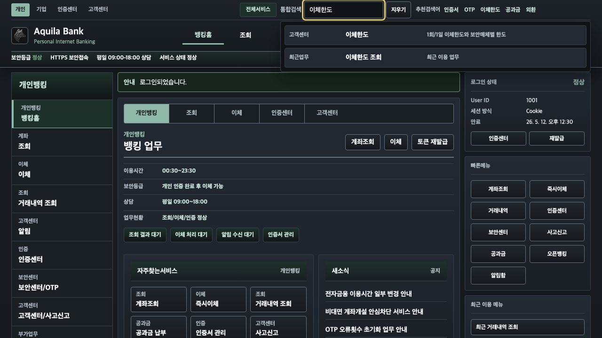
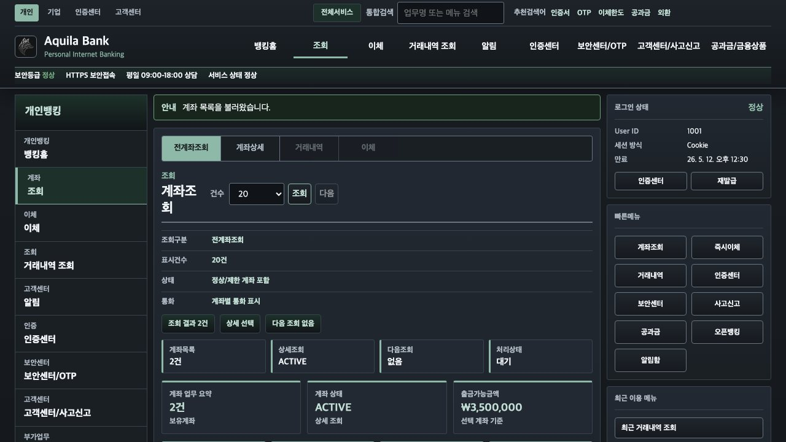
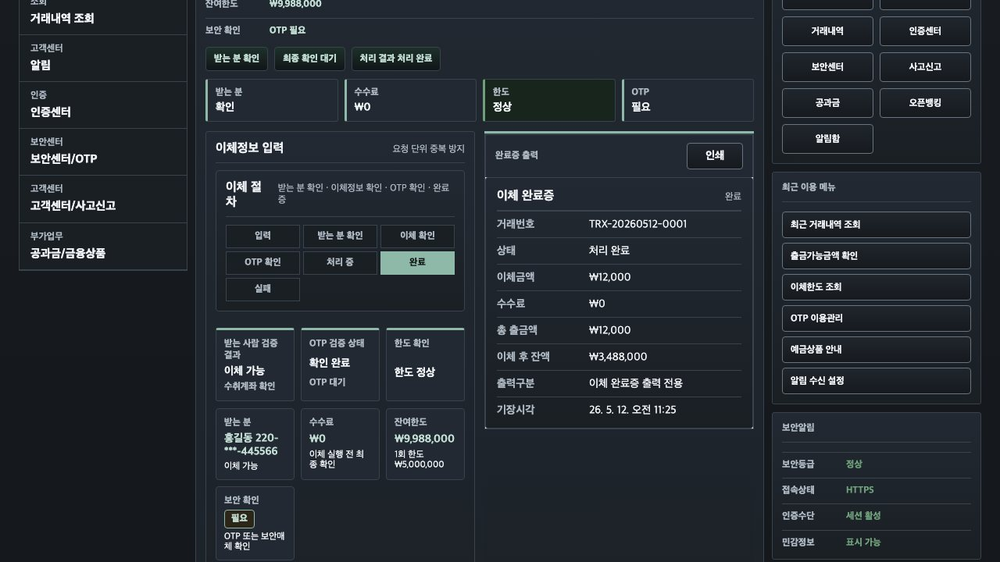
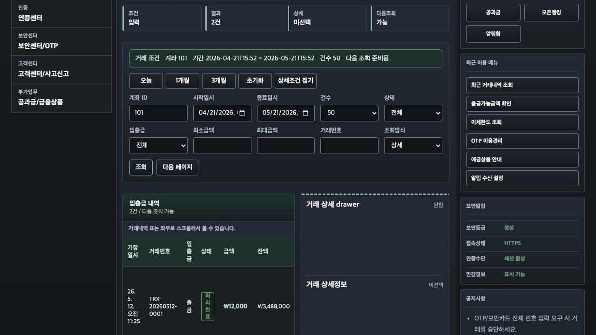
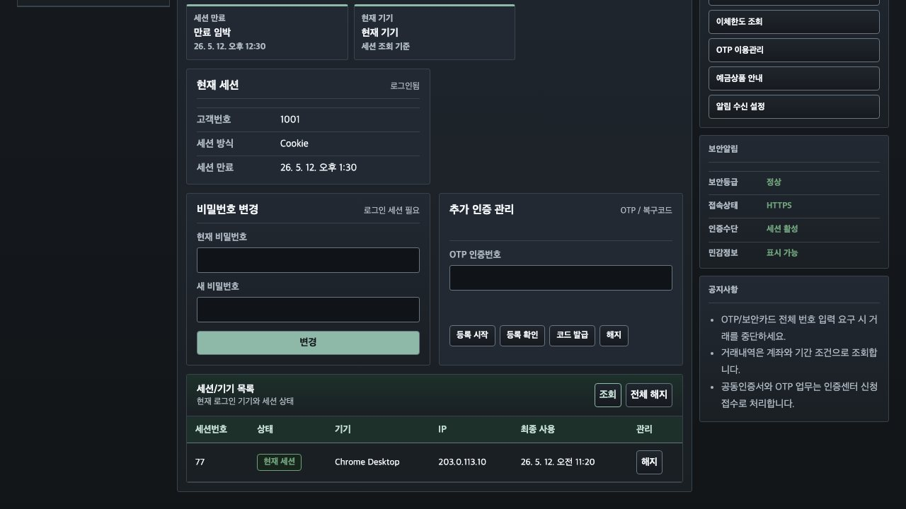
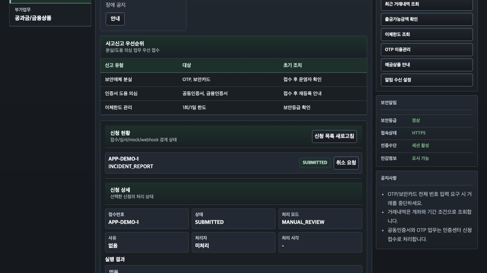

<p align="center">
  
</p>

<h1 align="center">Aquila Bank</h1>

<p align="center">
  <strong>개인 프로젝트 기준의 웹뱅킹 MVP</strong><br>
  내부 계좌 이체, 거래 정합성, 대량 거래 조회, 알림 흐름을 작은 cloud budget 안에서 검증합니다.
</p>

<p align="center">
  <a href="https://github.com/AquilaXk/aquila-bank">
    
  </a>
</p>

<p align="center">
  
  
  
  
  
  
</p>

---

## 목차

- [프로젝트 개요](#프로젝트-개요)
- [주요 기능](#주요-기능)
- [시스템 아키텍처](#시스템-아키텍처)
- [주요 프로세스](#주요-프로세스)
- [기술 스택](#기술-스택)
- [프로젝트 구조](#프로젝트-구조)
- [시작하기](#시작하기)
- [환경 변수](#환경-변수)
- [품질 게이트](#품질-게이트)
- [운영 기준](#운영-기준)
- [트러블슈팅](#트러블슈팅)
- [관련 문서](#관련-문서)
- [프로젝트에서 강조하고 싶은 점](#프로젝트에서-강조하고-싶은-점)

---

## 프로젝트 개요

### 배경

웹뱅킹 포트폴리오는 화면과 CRUD 기능만으로는 실제 운영 난도를 설명하기 어렵습니다. Aquila Bank는 은행권 전체 시스템을 재현하지 않고, 개인 프로젝트 범위에서 검증 가능한 핵심 경계만 좁게 잡았습니다.

| 문제 | 설명 |
| --- | --- |
| 정합성 우선순위 부족 | 잔액, 원장, 감사 이력이 기능 구현 뒤로 밀리면 송금 도메인을 설명하기 어렵습니다. |
| 대량 조회 경로 과장 | 전체 1억 건 검색/정렬을 온라인 목표로 두면 작은 인프라 budget과 맞지 않습니다. |
| 알림 경로 불명확 | 실시간 알림은 재시도, 중복 방지, 재동기화 경계가 함께 설명되어야 합니다. |
| 성능 주장 근거 부족 | fixture pass나 harness 통과만으로 성능 개선을 주장하지 않도록 evidence 기준이 필요합니다. |

### 목표

실제 은행 운영 서비스를 대체하는 것이 아니라, 웹뱅킹 핵심 흐름을 다음 기준으로 보여주는 프로젝트입니다.

| 구분 | AS-IS | TO-BE |
| --- | --- | --- |
| 거래 처리 | API 성공 응답 중심 | 계좌 잔액, 원장, 감사 추적 경계 우선 |
| 거래 조회 | offset/전체 검색 중심 | `accountId + 기간 + keyset pagination` bounded query |
| 알림 | 요청 처리와 강결합 | outbox, Kafka 선택 publish, inbox, SSE fan-out 분리 |
| 운영 검증 | 로컬 테스트 중심 | OCI A1 budget과 live artifact 기준 분리 |

### 핵심 가치

- **거래 정합성 우선**: 계좌 잔액, 원장, 감사 추적을 기능 수보다 먼저 둡니다.
- **작은 인프라 기준**: OCI A1 Flex 4 OCPU / 24GB + 200GB data volume을 기준 budget으로 둡니다.
- **대량 조회 제한**: 1억 건 전체 검색이 아니라 계좌/기간/커서 기반 bounded read path를 목표로 합니다.
- **비동기 운영 경계**: outbox retry, Kafka publish, notification inbox, SSE replay 경계를 분리합니다.
- **증거 기반 성능 판단**: `[Perf]` 주장은 OCI 또는 production-like live artifact가 있을 때만 사용합니다.

공과금, 오픈뱅킹, 인증서, 보안매체 같은 메뉴는 실제 기관 연동이 아니라 고객 신청 접수와 mock/webhook boundary를 보여주는 데모 범위입니다. 운영자 처리와 callback 샘플은 [Customer Application Mock Webhook](docs/customer-application-mock-webhook.md)에 정리했습니다.

## 주요 기능

| 기능 | 설명 | 기술 포인트 |
| --- | --- | --- |
| 계좌 관리 | 계좌 생성, 상태 관리, 잔액 조회 | 계좌 상태 정책, snapshot 점검/복구 데모 |
| 내부 이체 | 송금, preview, 부분 취소, 한도/잔액/상태 검증 | command idempotency, 원장 감사 추적 |
| 거래 조회 | 계좌별 거래 목록과 상세 조회 | keyset pagination, covering index, timeout |
| 인증/보안 | JWT access token, refresh token session, MFA TOTP | session revoke, backup code, remember device |
| 고객 신청 | 신청 접수, 조회, 취소, 운영자 검토/승인/실행 | 상태 전이 감사, mock webhook boundary |
| 알림 | 알림 inbox, unread projection, SSE stream | outbox retry, Kafka 선택 publish, replay |
| 운영 도구 | 내부 admin API, recovery action, metric/exporter | audit search, admission control, DLQ/redrive |

### 실제 고객뱅킹 화면

메인 화면에서 메뉴와 통합검색 흐름을 먼저 확인할 수 있고, 계좌/이체/거래내역 같은 보호 업무는 인증 상태에 맞춰 분리합니다.



로그인 후에는 전계좌조회, 즉시이체, 거래내역 keyset 조회, 인증센터 세션 관리, 고객센터 신청 상태를 같은 고객뱅킹 shell 안에서 처리합니다.

#### 계좌조회

보유 계좌 목록, 계좌 상태, 출금 가능 금액을 한 화면에서 확인하고 선택 계좌 기준으로 상세 조회를 이어갈 수 있습니다.



#### 즉시이체

받는 분 확인, 이체 확인, OTP 확인, 완료증 출력까지 이어지는 내부 이체 흐름을 보여줍니다.



#### 거래내역 조회

계좌, 기간, 상태, 금액 조건을 입력하고 keyset cursor 기준으로 다음 페이지를 이어 조회하는 대량 조회 UX입니다.



#### 인증센터

로그인 세션, 보안매체, OTP/복구코드, 기기별 세션 해지 같은 인증 후 보안 관리 화면입니다.



#### 고객센터/사고신고

사고신고와 고객 신청 접수 상태를 조회하고, 운영자 검토와 mock/webhook boundary를 확인하는 화면입니다.



## 시스템 아키텍처


```text
[Client]
  Next.js 14 / React 18
        |
        v
[Edge]
  Nginx reverse proxy
  rate limit / admission gate
        |
        v
[Backend]
  Spring Boot 4 / Java 21
  domain use case / adapter boundary
        |
        +--> PostgreSQL 18
        |    ledger / account / transaction read model
        |
        +--> Outbox worker
             Kafka 4.0 optional publish
             notification inbox / SSE fan-out

[Ops]
  GitHub Actions
  OCI A1 staging / production promotion
  k6 / Prometheus / Grafana optional evidence assets
```

## 주요 프로세스

### 1. 거래 정합성 경계

도메인은 Spring, JPA, web, SDK 구현에 의존하지 않습니다. 송금 흐름은 잔액 검증, 한도 정책, 원장 기록, 감사 추적을 같은 업무 경계로 보고, inbound/outbound adapter는 `global`에 둡니다.

| 설계 원칙 | 내용 |
| --- | --- |
| domain 독립성 | `domain`은 framework/infrastructure 구현에 의존하지 않습니다. |
| 원장 우선 | 송금 결과는 잔액 변경뿐 아니라 감사 가능한 원장 흐름으로 설명합니다. |
| idempotency | 재시도 상황에서 같은 command가 중복 실행되지 않도록 경계를 둡니다. |
| audit trail | 상태 변경과 운영자 조작은 추적 가능한 기록으로 남깁니다. |

### 2. 1억 건 거래 조회 경로

온라인 조회 목표는 전체 데이터 검색이 아니라 bounded query입니다.

```text
accountId + date range + status + cursor
        |
        v
covering index / keyset pagination
        |
        v
small page response / timeout / admission control
```

- 전체 1억 건 검색, 집계, 정렬은 온라인 목표에서 제외합니다.
- read model과 원본 거래 데이터는 필요 시 분리 가능한 구조로 둡니다.
- timeout, DB pool, admission control, edge reject curve를 같은 조회 경로의 비용으로 봅니다.

### 3. Outbox와 실시간 알림

쓰기 transaction 안에서 outbox event를 적재하고, worker가 외부 publish/delivery를 분리합니다.

| 단계 | 역할 |
| --- | --- |
| outbox claim | 미발송 event를 작은 batch로 점유하고 재시도 상태를 관리합니다. |
| Kafka publish | Kafka enabled 상태에서는 topic/bootstrap 설정 누락을 startup 실패로 처리합니다. |
| inbox consume | 사용자 알림 inbox와 unread projection을 갱신합니다. |
| SSE fan-out | reconnect gap은 bounded replay와 pull API 재동기화로 보완합니다. |
| DLQ/redrive | 실패 event는 운영 API로 확인하고 재처리 경로를 둡니다. |

### 4. Evidence 기반 성능 판단

성능 개선 PR은 live artifact를 기준으로 판단합니다.

- OCI 또는 production-like 환경에서 실행한 run id, artifact URL, 주요 수치를 남깁니다.
- synthetic fixture pass, mock evidence, harness-only pass는 성능 개선 증거로 보지 않습니다.
- shell script, workflow, evidence harness 수정은 병목 확인을 막는 차단 사유가 있을 때만 최소 범위로 진행합니다.

### 5. Delivery flow

```text
issue -> docs/agent brief -> branch from main -> commit plan -> push -> PR to main
        |
        v
GitHub Actions CI -> main merge -> staging auto deploy -> production manual promotion/tag
```

- 작업 브랜치는 `main`에서 짧게 분기하고 PR base는 `main`으로 둡니다.
- `main` merge SHA는 staging에 자동 배포합니다.
- production은 staging 성공 같은 SHA만 GitHub Environment 수동 승인 또는 `prod-*` tag로 승격합니다.
- 미완성 기능은 장기 `develop` 브랜치 대신 feature flag로 기본 비노출 처리합니다.

## 기술 스택

| 영역 | 스택 |
| --- | --- |
| Frontend | Next.js 14, React 18, TypeScript |
| Backend | Spring Boot 4, Java 21, Spring Security, JDBC, Flyway |
| Data | PostgreSQL 18 |
| Event / Async | Kafka 4.0, Outbox, SSE |
| Edge / Ops | Nginx, Docker Compose, OCI A1 Flex, GitHub Actions |
| Observability / Load Test | Prometheus, Grafana, k6, Postgres exporter |
| Quality | Gradle check, Spotless, JaCoCo, Testcontainers, Next lint |

## 프로젝트 구조

```text
.
├── front/                  # Next.js 14 / React 18 frontend
├── back/                   # Spring Boot 4 / Java 21 backend
├── infra/                  # OCI/AWS 선택형 Terraform baseline
├── ops/                    # Nginx, Prometheus, Grafana 운영 baseline
├── tools/                  # test/evidence/ops helper scripts
├── .github/                # issue/PR templates, CI/CD workflows
├── compose.yml             # 로컬 PostgreSQL/Kafka 개발 인프라
├── compose.t3micro.yml     # 작은 CPU/메모리 budget 근사 overlay
└── compose.loadtest.yml    # k6/Prometheus/Grafana 부하테스트 overlay
```

## 시작하기

### 사전 준비

- Java 21
- Node.js LTS
- Yarn Classic
- Docker Compose

### 1. 저장소 클론

```bash
git clone https://github.com/AquilaXk/aquila-bank.git
cd aquila-bank
```

### 2. 로컬 환경 파일 준비

```bash
cp back/.env.example back/.env
cp front/.env.example front/.env.local
```

프런트는 백엔드 API 주소를 `NEXT_PUBLIC_API_BASE_URL`로 받습니다.

```bash
NEXT_PUBLIC_API_BASE_URL=http://localhost:8080
```

### 3. 개발용 인프라 실행

```bash
docker compose up -d postgres kafka
```

- PostgreSQL: `localhost:5432`
- Kafka: `localhost:9092`

### 4. 백엔드 실행

```bash
source back/.env
./back/gradlew -p back bootRun
```

- Backend: `http://localhost:8080`
- Actuator health: `http://localhost:8080/actuator/health`
- Prometheus scrape: `http://localhost:8080/actuator/prometheus`

### 5. 프런트 실행

```bash
yarn --cwd front install
NEXT_PUBLIC_API_BASE_URL=http://localhost:8080 yarn --cwd front dev
```

다른 포트를 쓰려면 `PORT`를 함께 지정합니다.

```bash
NEXT_PUBLIC_API_BASE_URL=http://localhost:8080 PORT=3001 yarn --cwd front dev
```

- Front: `http://localhost:3000`

## 환경 변수

대표 로컬 변수는 `back/.env.example`, `front/.env.example`에 정리되어 있습니다.

| 영역 | 변수 | 설명 |
| --- | --- | --- |
| Frontend | `NEXT_PUBLIC_API_BASE_URL` | 프런트에서 호출할 백엔드 API base URL |
| Database | `DB_HOST`, `DB_PORT`, `DB_NAME`, `DB_USERNAME`, `DB_PASSWORD` | PostgreSQL 연결 정보 |
| Database budget | `DB_POOL_MAX_SIZE`, `DB_STATEMENT_TIMEOUT_MS`, `DB_LOCK_TIMEOUT_MS` | 작은 인프라 기준 pool/timeout 상한 |
| Security | `SECURITY_JWT_SECRET`, `SECURITY_JWT_ISSUER` | JWT 발급과 검증 기준 |
| Bootstrap | `SECURITY_AUTH_BOOTSTRAP_API_ENABLED`, `SECURITY_AUTH_BOOTSTRAP_API_TOKEN` | 로컬 bootstrap API 제어 |
| Outbox/Kafka | `OUTBOX_KAFKA_ENABLED`, `OUTBOX_KAFKA_BOOTSTRAP_SERVERS` | Kafka publish 활성화와 bootstrap server |
| Notification | `NOTIFICATION_INBOX_CONSUMER_ENABLED`, `NOTIFICATION_INBOX_CONSUMER_CONCURRENCY` | 알림 inbox consumer 실행 기준 |

운영 profile은 외부 PostgreSQL 연결을 위해 `DB_URL` 또는 `DB_HOST` 계열 변수를 사용합니다. 자세한 backend runtime 기준은 [back/README.md](back/README.md)를 확인합니다.

## 품질 게이트

### Backend

```bash
./back/gradlew -p back check
```

- unit/slice test, Testcontainers integration test, query plan gate, JaCoCo coverage verification, Spotless check를 포함합니다.
- 같은 워크트리에서 backend 검증을 병렬 실행할 때는 `tools/test/with-resource-lock.sh`로 직렬화합니다.

### Frontend

```bash
yarn --cwd front lint
```

### Frontend contract

```bash
yarn --cwd front test:login-runtime
yarn --cwd front test:ui-contract
```

프런트 contract 검증은 서버가 없어도 실행할 수 있습니다. 실제 로그인 데모는 백엔드가 실행된 상태에서 확인합니다.

### Load / Evidence

```bash
docker compose -f compose.yml -f compose.loadtest.yml --profile loadtest up -d
```

- k6, Prometheus, Grafana, Alertmanager, Postgres exporter는 부하테스트/선택 관측 용도입니다.
- 1억 건 primary evidence는 OCI A1 PostgreSQL data volume의 fixture와 cloud/off-host k6 summary로 닫습니다.

## 운영 기준

### Runtime baseline

| 항목 | 기준 |
| --- | --- |
| Database | PostgreSQL 18 |
| Event broker | Kafka 4.0 single-node KRaft broker |
| Primary 100m evidence | OCI A1 Flex 4 OCPU / 24GB + self-managed PostgreSQL 18 + 200GB Block Volume |
| Query/admission budget | OCI A1 4 OCPU / 24GB 기준 작은 CPU/메모리 budget |
| Optional legacy app smoke | EC2 t3.small + gp3 40GiB |

### Environment split

- 로컬 개발: Docker Compose 기반 PostgreSQL/Kafka
- 로컬 small-budget 근사 검증: `compose.t3micro.yml`
- 로컬 HTTP 부하테스트: `compose.loadtest.yml`
- cloud 1억 건 조회 테스트: OCI A1 PostgreSQL fixture + off-host/cloud k6 runner
- 비용형 DB/capacity 기준: [infra/terraform/oci/paid-a1-postgres](infra/terraform/oci/paid-a1-postgres/README.md)
- reverse proxy baseline: [ops/nginx](ops/nginx/README.md)
- monitoring baseline: [ops/prometheus](ops/prometheus/README.md)

## 트러블슈팅

### 로그인 또는 API 호출에서 `Failed to fetch`

| 항목 | 확인 |
| --- | --- |
| 백엔드 상태 | `curl http://localhost:8080/actuator/health` |
| 개발 인프라 | `docker compose up -d postgres kafka`가 먼저 실행됐는지 확인 |
| 프런트 env | `NEXT_PUBLIC_API_BASE_URL=http://localhost:8080` 설정 확인 |
| 단독 프런트 실행 | 백엔드가 없으면 로그인, 계좌, 이체, 고객 신청 API 호출은 실패 안내를 표시 |

### Kafka 알림 경로가 동작하지 않음

| 항목 | 확인 |
| --- | --- |
| broker | `localhost:9092` Kafka healthcheck 상태 |
| outbox publish | `OUTBOX_KAFKA_ENABLED=true` |
| topic 설정 | `OUTBOX_KAFKA_TOPIC_DEFAULT`, transfer topic 변수 |
| inbox consume | `NOTIFICATION_INBOX_CONSUMER_ENABLED=true` |

### 대량 조회 성능 판단

| 항목 | 기준 |
| --- | --- |
| PR type | live artifact 없는 harness 정리는 `[Perf]`가 아니라 `[Test]`, `[CI]`, `[Chore]` |
| 병목 근거 | 코드 hot path, DB query/index/statistics, runtime/application 설정 중 하나 |
| 증거 | OCI 또는 production-like run id, artifact URL, 주요 수치 |

## 관련 문서

| 문서 | 내용 |
| --- | --- |
| [back/README.md](back/README.md) | 백엔드 도메인/API/운영 상세 |
| [front/README.md](front/README.md) | 프런트 실행과 API 연결 가이드 |
| [Customer Application Mock Webhook](docs/customer-application-mock-webhook.md) | 고객 신청 mock/webhook boundary |
| [OCI A1 PostgreSQL baseline](infra/terraform/oci/paid-a1-postgres/README.md) | 비용형 PostgreSQL baseline |
| [Nginx reverse proxy baseline](ops/nginx/README.md) | edge reverse proxy와 gate 기준 |
| [Prometheus/Grafana baseline](ops/prometheus/README.md) | 관측 asset과 dashboard 기준 |

## 프로젝트에서 강조하고 싶은 점

Aquila Bank는 실제 은행 서비스를 대체하려는 구현이 아닙니다. 개인 프로젝트 범위에서 웹뱅킹 핵심 흐름을 정합성 있게 구성하고, 작은 OCI A1 budget에서 대량 거래 조회와 알림 경로를 어떻게 제한하고 검증할지 보여주는 포트폴리오입니다.

기능 수보다 거래 정합성, bounded query, outbox/SSE 알림, admission control, 운영 evidence를 같은 레벨에서 관리하는 데 초점을 둡니다. 외부기관 연동과 은행권 운영통제는 명시적으로 범위 밖에 둡니다.
