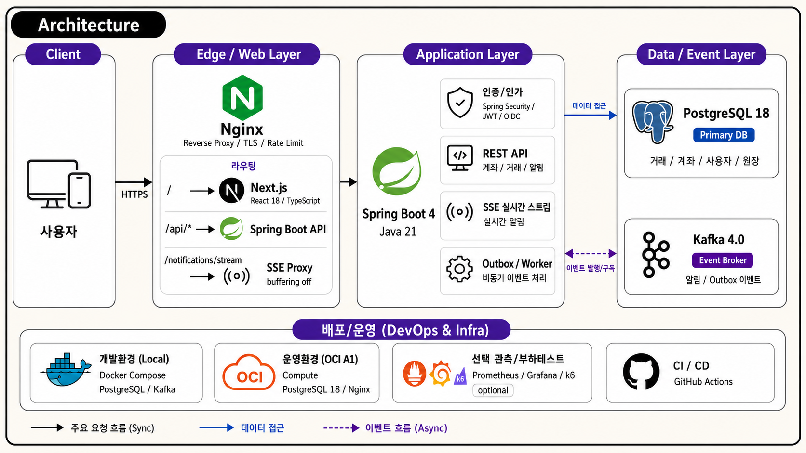

# Aquila Bank

개인 프로젝트 기준의 웹뱅킹 MVP입니다. 내부 계좌 이체, 거래 정합성, 대량 조회, 알림 흐름을 작은 cloud budget 안에서 검증하는 데 초점을 둡니다.
실제 은행 운영 서비스가 아니라 `1억 건 거래 read model`, `bounded query`, `outbox 기반 알림`, `OCI A1 운영 budget`, `회귀 방지 gate`를 포트폴리오 수준으로 보여주는 프로젝트입니다.



## 프로젝트 개요

Aquila Bank는 제한된 인프라에서 무제한 트래픽을 처리하는 프로젝트가 아닙니다. OCI A1 Flex 4 OCPU / 24GB + data 200GB self-managed PostgreSQL 18 기준으로 1억 건 거래 데이터를 적재하고, 계좌/기간/keyset page처럼 bounded 된 조회만 온라인 목표로 둡니다.

- 프런트는 `Next.js 14 + React 18 + TypeScript`, 백엔드는 `Spring Boot 4 + Java 21`로 구성했습니다.
- 데이터 기준은 `PostgreSQL 18`이고, 이벤트/알림 경로는 `Kafka 4.0`과 outbox 패턴으로 분리했습니다.
- 운영 경로는 `Nginx reverse proxy`, GitHub Actions CI/CD, OCI A1 staging/production 승격 기준을 중심으로 정리했습니다.
- Prometheus/Grafana/k6는 부하테스트와 선택 관측 자산으로 두고, 같은 host 상시 필수 운영 구성으로 보지 않습니다.

## 개인 프로젝트 범위

### In Scope

- 로그인, refresh token session, MFA TOTP
- 계좌/잔액/거래 내역 조회
- 내부 계좌 이체, 이체 preview, 한도/잔액/상태 검증
- command idempotency와 기본 감사 이력
- 고객 신청 접수/조회/취소와 운영자 검토/승인/실행 상태 전이
- 알림 inbox/outbox, SSE, logging/webhook 선택 발송 경계

### Out of Scope

- 타행 이체망 adapter와 실제 지급결제망 정산
- 실제 공과금, 오픈뱅킹, 인증기관, SMS/EMAIL vendor 계약
- 정산/보상/reconciliation을 포함한 은행권 운영 마감 업무
- provider callback HMAC/signature 같은 상용 운영 계약
- 고객 등급, 위험 등급, 승인 매트릭스, 사고 신고 즉시 계좌 잠금 자동화
- 등록 수취인, 기기/IP 기반 고급 탐색 방어와 은행권 수준 통합 모니터링

공과금, 오픈뱅킹, 인증서, 보안매체 같은 메뉴는 실제 기관 연동이 아니라 신청 접수와 mock/webhook boundary를 보여주는 데모 범위입니다.

## 왜 이 프로젝트가 차별점이 있는가

- `거래 정합성`을 기능 수보다 앞에 두었습니다.
  - 계좌 잔액, 원장, 감사 추적 경계를 분리하고 도메인이 framework/infrastructure 구현에 의존하지 않도록 관리합니다.
- `작은 인프라에서 버티는 읽기 경로`를 기준으로 설계했습니다.
  - 전체 1억 건 검색/집계/정렬은 온라인 목표에서 제외하고, `accountId + 기간 + keyset pagination` 경로를 중심으로 봅니다.
- `실시간 알림을 운영 가능한 비동기 경로`로 다룹니다.
  - outbox claim, Kafka publish, notification inbox consume, SSE fan-out 경로에서 재시도와 중복 방지를 분리합니다.
- `성능 주장과 운영 증거`를 분리합니다.
  - fixture pass나 harness 통과만으로 성능 개선을 주장하지 않고, OCI 또는 production-like live artifact를 기준으로 판단합니다.

## 핵심 기능

### Banking Domain

- 계좌 생성 / 상태 관리 / 잔액 조회
- 송금, 부분 취소, 한도 정책
- 거래 상세 조회와 계좌별 거래 목록 조회
- 원장 감사 추적과 snapshot 점검/복구 데모 경로

### Transaction Read Path

- 1억 건 transaction read model fixture 기준 검증
- 계좌/기간/status/cursor 조건 기반 bounded query
- keyset pagination, covering index, timeout, admission control
- archive query와 retention cutoff load test 기준 분리

### Auth & Security

- JWT access token / refresh token session
- MFA TOTP / backup code / remember device
- password recovery token과 delivery outbox
- internal admin API 인증, 감사 검색, 상태 변경 이력

### Notification & Async

- notification inbox / unread projection
- SSE stream, replay, reconnect storm 방어
- outbox dispatcher adaptive batch/backoff
- logging/webhook 선택 발송 worker와 DLQ/redrive 운영 API

### Operations

- Nginx reverse proxy baseline과 transaction-read edge gate
- GitHub Actions backend/frontend/main CI
- OCI A1 staging deploy와 production promotion gate
- k6, Prometheus, Grafana 기반 부하테스트/관측 asset

## 기술 스택

| 영역 | 스택 |
| --- | --- |
| Frontend | Next.js 14, React 18, TypeScript |
| Backend | Spring Boot 4, Java 21, Spring Security, JDBC, Flyway |
| Data | PostgreSQL 18 |
| Event / Async | Kafka 4.0, Outbox, SSE |
| Edge / Ops | Nginx, Docker Compose, OCI A1 Flex, GitHub Actions |
| Observability / Load Test | Prometheus, Grafana, k6, Postgres exporter |
| Quality | Gradle check, Spotless, JaCoCo, Testcontainers, Next lint |

## 아키텍처 포인트

### 1. Hexagonal Boundary

- `domain`은 Spring/JPA/web/sdk 구현에 의존하지 않습니다.
- inbound/outbound adapter와 persistence/web/security 설정은 `global`에 둡니다.
- 비즈니스 규칙은 `util`이 아니라 도메인 model/use case/service에 둡니다.

### 2. Bounded Read Path

- 온라인 거래 목록 조회는 `accountId + 기간 + keyset pagination` 중심으로 제한합니다.
- 1억 건 전체 검색/집계/정렬은 목표에서 제외합니다.
- timeout, DB pool, admission control, edge reject curve를 함께 봅니다.

### 3. Outbox & Notification

- 쓰기 transaction 안에서 outbox를 적재하고 worker가 외부 publish/delivery를 분리합니다.
- Kafka enabled 상태에서는 bootstrap/topic 필수값 누락을 startup 실패로 처리합니다.
- SSE는 실시간 알림을 제공하되 reconnect gap은 bounded replay와 pull API 재동기화로 다룹니다.

### 4. Evidence-Based Performance

- `[Perf]` 범위는 OCI 또는 production-like live artifact가 있을 때만 사용합니다.
- synthetic fixture pass, mock evidence, harness-only pass는 성능 개선 증거로 보지 않습니다.
- 작은 OCI A1 budget에서 CPU/메모리/IO 비용이 낮은 검증된 PostgreSQL 운영 패턴을 우선합니다.

## 프로젝트 구조

```text
.
├── front/                  # Next.js 14 / React 18 frontend
├── back/                   # Spring Boot 4 / Java 21 backend
├── infra/                  # OCI/AWS 선택형 Terraform baseline
├── ops/                    # Nginx, Prometheus, Grafana 운영 baseline
├── tools/                  # test/evidence/ops helper scripts
├── .github/                # issue/PR templates, CI/CD workflows
├── compose.yml             # 로컬 PostgreSQL/Kafka 개발 인프라
├── compose.t3micro.yml     # 작은 CPU/메모리 budget 근사 overlay
└── compose.loadtest.yml    # k6/Prometheus/Grafana 부하테스트 overlay
```

## 로컬 실행

### 사전 준비

- Java 21
- Node.js LTS
- Yarn Classic
- Docker Compose

### 1. 개발용 인프라 실행

```bash
docker compose up -d postgres kafka
```

- PostgreSQL: `localhost:5432`
- Kafka: `localhost:9092`

### 2. 백엔드 실행

```bash
./back/gradlew -p back bootRun
```

- Backend: `http://localhost:8080`
- Actuator health: `http://localhost:8080/actuator/health`
- Prometheus scrape: `http://localhost:8080/actuator/prometheus`

### 3. 프런트 실행

```bash
yarn --cwd front install
yarn --cwd front dev
```

- Front: `http://localhost:3000`

## 품질 게이트

### Backend

```bash
./back/gradlew -p back check
```

- unit/slice test, Testcontainers integration test, query plan gate, JaCoCo coverage verification, Spotless check를 포함합니다.
- 같은 워크트리에서 backend 검증을 병렬 실행할 때는 `tools/test/with-resource-lock.sh`로 직렬화합니다.

### Frontend

```bash
yarn --cwd front lint
```

### Load / Evidence

```bash
docker compose -f compose.yml -f compose.loadtest.yml --profile loadtest up -d
```

- k6, Prometheus, Grafana, Alertmanager, Postgres exporter는 부하테스트/선택 관측 용도입니다.
- 1억 건 primary evidence는 OCI A1 PostgreSQL data volume의 fixture와 cloud/off-host k6 summary로 닫습니다.

## Runtime Baseline

- database: `PostgreSQL 18`
- event broker: `Kafka 4.0` single-node KRaft broker
- primary 100m evidence: `OCI A1 Flex 4 OCPU / 24GB + self-managed PostgreSQL 18 + 200GB Block Volume`
- query/admission budget: OCI A1 `4 OCPU / 24GB` 기반 작은 CPU/메모리 budget
- optional legacy app smoke: `EC2 t3.small + gp3 40GiB`

## Environment Split

- 로컬 개발: Docker Compose 기반 PostgreSQL/Kafka
- 로컬 small-budget 근사 검증: `compose.t3micro.yml`
- 로컬 HTTP 부하테스트: `compose.loadtest.yml`
- cloud 1억 건 조회 테스트: OCI A1 PostgreSQL fixture + off-host/cloud k6 runner
- 비용형 DB/capacity 기준: [infra/terraform/oci/paid-a1-postgres](infra/terraform/oci/paid-a1-postgres/README.md)
- reverse proxy baseline: [ops/nginx](ops/nginx/README.md)
- monitoring baseline: [ops/prometheus](ops/prometheus/README.md)

## Delivery Flow

- 작업 브랜치는 `main`에서 짧게 분기하고 PR base는 `main`으로 둡니다.
- PR 리뷰와 backend/frontend CI 통과 후 `main`에 병합합니다.
- `main` merge SHA는 staging에 자동 배포합니다.
- production은 staging 성공 같은 SHA만 GitHub Environment 수동 승인 또는 `prod-*` tag로 승격합니다.
- 미완성 기능은 장기 `develop` 브랜치 대신 feature flag로 기본 비노출 처리합니다.

## 관련 문서

- 백엔드 상세 설명: [back/README.md](back/README.md)
- 프런트 실행 가이드: [front/README.md](front/README.md)
- OCI A1 PostgreSQL baseline: [infra/terraform/oci/paid-a1-postgres/README.md](infra/terraform/oci/paid-a1-postgres/README.md)
- Nginx reverse proxy baseline: [ops/nginx/README.md](ops/nginx/README.md)
- Prometheus/Grafana baseline: [ops/prometheus/README.md](ops/prometheus/README.md)

## 프로젝트에서 강조하고 싶은 점

이 프로젝트는 실제 은행 서비스를 대체하려는 구현이 아니라, 개인 프로젝트 범위에서 웹뱅킹 핵심 흐름을 정합성 있게 구성한 포트폴리오입니다.
대량 거래 조회, outbox/SSE 알림, admission control, 운영 evidence를 코드와 문서의 같은 레벨에서 관리하되, 외부기관 연동과 은행권 운영통제는 명시적으로 범위 밖에 둡니다.
